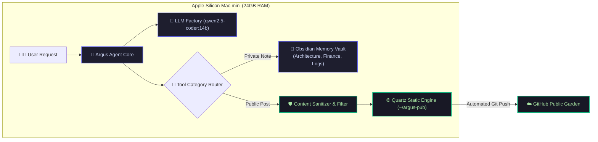

   System Live & Operational
  ⚡ Mac mini M4 (24GB RAM)
  🧠 qwen2.5-coder:14b

# Meet Argus: Local AI with Static Publishing

> **Executive Overview:** Argus is an autonomous, private AI assistant running 100% locally on Apple Silicon hardware. It orchestrates private knowledge management in Obsidian and automatically deploys curated tutorials and build logs to this public Quartz digital garden.

---

## 🏗️ Interactive System Architecture

---

## ⚡ Hardware Memory Budget & Allocation

On a 24GB Unified Memory Mac, allocation efficiency is paramount for sustained high-throughput inference without swapping:

  

    Unified Memory Distribution (24 GB)
    ~17.2 GB Active / 6.8 GB Headroom
  

  

    

    

    

    

  

  

    

 <strong>Model Weights</strong> (9.0 GB Q4_K_M)

    

 <strong>KV Cache & Context</strong> (4.2 GB)

    

 <strong>macOS System</strong> (4.0 GB)

    

 <strong>Free Headroom</strong> (6.8 GB)

  

---

## 💻 Live Agent Execution Preview

Here is how Argus handles live tool routing and automated publishing:

  

    
    
    
    argus-agent — zsh — 80x24
  

  

    

      argus-agent ❯
      uv run main_agent.py --publish
    

    
[*] Initializing Ollama harness: qwen2.5-coder:14b (temp=0.1)

    
[*] Routing intent: 'publish_to_web' with sanitized metadata

    
[✓] Formatted Quartz markdown: ~/argus-pub/content/building-local-ai-assistant.md

    
[✓] Git cycle completed: [main c840401] publish: Building a Local AI Assistant

    
[✓] Deployed live to origin main on GitHub 

  

---

## 🚀 Key System Capabilities

  

    🔒
    <h3>Zero-Leak Privacy Firewall</h3>
    
Local paths, secrets, API tokens, and private financial logs are automatically stripped before reaching the static publishing tree.

  

  

    ⚡
    <h3>Sub-Second Static Builds</h3>
    
Quartz parses and renders markdown pages in under 600ms, creating interactive graph visualizations and backlink popovers.

  

  

    🧠
    <h3>14B Coding Specialist</h3>
    
Powered by <code>qwen2.5-coder:14b</code> for native JSON tool calling, accurate categorization, and structured markdown synthesis.

  

---

## 🛠️ Automated Publishing Pipeline

  

    
1

    

      <h4>Inference & Tool Call Generation</h4>
      
Argus receives prompt instructions, plans the document structure, and generates validated Pydantic parameters.

    

  

  

    
2

    

      <h4>Sanitization & Quartz Frontmatter Rendering</h4>
      
The publisher skill applies SEO tags, frontmatter timestamps, and strips internal workspace markers.

    

  

  

    
3

    

      <h4>Autonomous Git Commit & Live Deployment</h4>
      
Argus stages the article in <code>~/argus-pub</code>, creates a semantic commit, and pushes live to GitHub.

    

  

---

  
🔍 Deep Dive: How the Dual-Repository Boundary Works

  

    
The dual-repository architecture guarantees security by physical Git boundary separation:

    <ul>
      <li><strong><code>argus-core</code> (Private):</strong> Contains the virtual environment, LLM factories, API prompts, private memory vault, and agent routines. This repository is strictly private.</li>
      <li><strong><code>argus-pub</code> (Public):</strong> A clean, independent Quartz repository containing only the compiled static web output and public articles. Even if public repository access is compromised, private memory vault logs remain completely untouched on local storage.</li>
    </ul>
  

