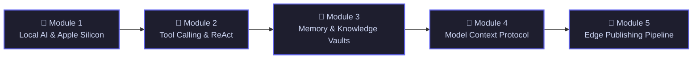

   Open Curriculum
  🎓 Ground Zero to Production
  ⚡ Apple Silicon & Ollama

# Zero-to-Hero AI Agent Engineering

> **Welcome to the public learning curriculum!** This curriculum documents our ground-zero journey of mastering local LLMs, agentic tool dispatching, persistent memory vaults, and global edge publishing on Apple Silicon. Follow along and build your own autonomous assistant step-by-step.

---

## 🗺️ Curriculum Roadmap

---

## 📚 Course Modules

  <!-- Module 1 -->
  

    

      Track 1 • Hardware & Inference
      ⚡ In Progress
    

    <h3>Module 1: Local AI & Apple Silicon Inference Mechanics</h3>
    
Understand how Large Language Models execute locally on Apple Silicon. Demystify Unified Memory bandwidth, 4-bit quantization (Q4_K_M), KV Cache allocation, and the Ollama runtime engine.

    

      Unified Memory
      Q4_K_M Quantization
      KV Cache Math
      Ollama Daemon
      qwen2.5-coder:14b
    

    <a href="/module-1-local-ai-inference-mechanics" style="display: inline-flex; align-items: center; gap: 6px; font-weight: 600; font-size: 0.875rem; color: #6366f1;">
      Read Lesson 1: Demystifying Local Inference →
    </a>
  

  <!-- Module 2 -->
  

    

      Track 2 • Agent Tooling
      ⏳ Upcoming
    

    <h3>Module 2: Tool Calling & The ReAct Execution Loop</h3>
    
How does a text-generating neural network execute Python functions and web searches? Learn JSON schema tool binding, the ReAct pattern (Reason + Act), and streaming SSE token updates.

    

      Function Calling
      ReAct Synthesis Loop
      Server-Sent Events (SSE)
      FastAPI Async Engine
    

  

  <!-- Module 3 -->
  

    

      Track 3 • Long-Term Memory
      ⏳ Upcoming
    

    <h3>Module 3: Memory Systems & Obsidian Knowledge Graph</h3>
    
Build persistent, human-readable long-term memory for local agents. Implement taxonomy categorization, YAML frontmatter indexing, and hybrid semantic retrieval across Obsidian markdown notes.

    

      Obsidian Vault
      Frontmatter Taxonomy
      Hybrid RAG
      Vector Embeddings
    

  

  <!-- Module 4 -->
  

    

      Track 4 • Tool Standards
      ⏳ Upcoming
    

    <h3>Module 4: The Model Context Protocol (MCP) in Practice</h3>
    
Demystify Anthropic's Model Context Protocol (the USB-C of AI integrations). Connect MCP servers to external databases, GitHub, filesystem APIs, and custom local tools.

    

      Model Context Protocol
      MCP Server Harness
      External DB Connectors
      Sandboxed Execution
    

  

  <!-- Module 5 -->
  

    

      Track 5 • Production Edge
      ⏳ Upcoming
    

    <h3>Module 5: Automated Edge Deployments & Cloudflare Workers</h3>
    
Take insights from local memory and deploy them globally to 300+ edge locations in sub-seconds using Cloudflare Workers Static Assets, Quartz, and automated Git CI/CD pipelines.

    

      Cloudflare Workers
      Quartz SSG
      Automated CI/CD
      Edge Caching
    

  

---

## 🎯 How to Learn with Us

1. **Follow the Lessons**: Each module contains theory, hardware benchmarks, code walkthroughs, and runnable examples.
2. **Build Along**: All code is open and reproducible on an Apple Silicon Mac or modern Linux workstation.
3. **Ask Questions**: Interact with Argus or contribute suggestions to our public repository!
