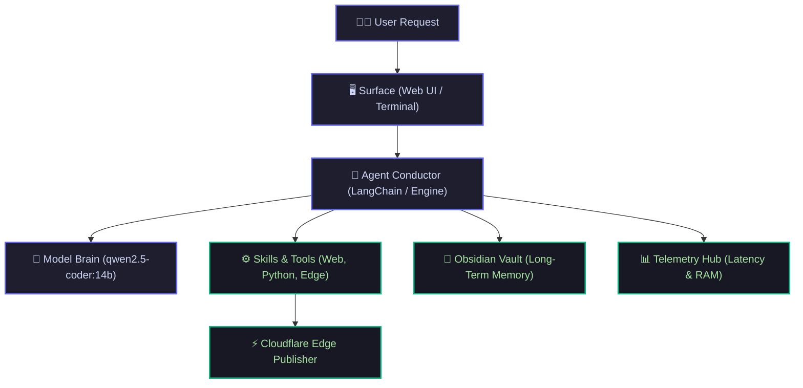

<div style="margin-bottom: 1.5rem;">
  <span class="status-badge live"><span class="dot"></span> Module 1 Master Guide</span>
  <span class="status-badge">🧠 qwen2.5-coder:14b</span>
  <span class="status-badge">⚡ 24GB Unified Memory</span>
</div>

# <span class="gradient-text">Module 1: Inside the LLM Brain, Synaptic Weights & Apple Silicon</span>

> **Ground Zero Concept:** Large Language Models are not magical thinking beings. Strip away the marketing hype, and an LLM has only one fundamental job: **Given a sequence of words, predict the single most probable next word based on 14 billion learned mathematical associations.**

---

## 🎭 The 8 Actors in a Local AI System

To understand how an AI assistant works, think of a movie production stage. The **Model** is only the lead actor—it needs 7 other systems to create a functional autonomous agent:



1. **The Model (`qwen2.5-coder:14b`)**: The mathematical brain predicting next words.
2. **The Runtime (`Ollama`)**: Loads 9.0GB weights into memory and fires GPU compute.
3. **The Agent Conductor (`Argus`)**: Decides when to answer vs when to call a tool.
4. **The Tools / Skills**: Hands and eyes (web scraper, vault reader, file writers).
5. **The Memory Vault**: Permanent Obsidian markdown filing cabinet.
6. **The Telemetry Engine**: Black-box flight recorder tracking latency & memory.
7. **The Edge Publisher**: Quartz + Cloudflare Workers for sub-second global publishing.
8. **The Surface**: The browser cockpit where you and Argus converse.

---

## 🧱 Stage 1: The Tokenizer (Words → Lego Bricks)

Computers cannot read English. Before the neural network processes a sentence, text is sliced into numeric barcodes called **Tokens**:

```text
"Argus is an autonomous AI agent"
       ↓
["Arg", "us", " is", " an", " autonomous", " AI", " agent"]
       ↓
[ 2803,  355,   374,   459,     39293,     15592,   8479  ]
```

<div class="mac-terminal">
  <div class="terminal-header">
    <span class="button close"></span>
    <span class="button minimize"></span>
    <span class="button maximize"></span>
    <span class="terminal-title">token-inspector — live output</span>
  </div>
  <div class="terminal-body">
    <div class="command-line">
      <span class="prompt">argus ❯</span>
      <span>python -m tiktoken "Argus on Apple Silicon"</span>
    </div>
    <div class="output success">[Token 1] "Arg"     → ID: 2803  (3 bytes)</div>
    <div class="output success">[Token 2] "us"      → ID: 355   (2 bytes)</div>
    <div class="output success">[Token 3] " on"     → ID: 389   (3 bytes)</div>
    <div class="output success">[Token 4] " Apple"  → ID: 8325  (6 bytes)</div>
    <div class="output success">[Token 5] " Silicon"→ ID: 38250 (8 bytes)</div>
    <div class="output highlight">Total: 5 tokens for 22 characters (~4.4 chars/token)</div>
  </div>
</div>

---

## 🗺️ Stage 2: Embeddings & Vector Arithmetic

A token ID like `2803` has no intrinsic meaning. To capture relationships, each token is mapped to a **4,096-dimensional coordinate vector** called an **Embedding**.

In this conceptual space, words with similar meanings live together, allowing **Conceptual Vector Arithmetic**:

$$\text{Vector}(\text{"King"}) - \text{Vector}(\text{"Man"}) + \text{Vector}(\text{"Woman"}) \approx \text{Vector}(\text{"Queen"})$$

<!-- INTERACTIVE WIDGET 1: VECTOR ARITHMETIC -->
<div class="explorable-widget">
<div class="widget-header">
<span class="widget-title">🎮 Interactive Explorable: Conceptual Vector Math</span>
<button onclick="runPubVectorMath()" class="action-btn">▶️ Run Vector Math: King - Man + Woman = Queen</button>
</div>
<p style="font-size: 0.85rem; color: #a6adc8; margin-bottom: 0.75rem;">Click the button to see the laser vector lines calculate conceptual arithmetic live in 2D space:</p>
<div style="background: #11111b; border: 1px solid #313244; border-radius: 10px; height: 260px; position: relative; overflow: hidden;">
<svg id="pub-vector-svg" style="width: 100%; height: 100%;" viewBox="0 0 650 240">
<line x1="30" y1="120" x2="620" y2="120" stroke="#313244" stroke-dasharray="4" />
<line x1="325" y1="20" x2="325" y2="220" stroke="#313244" stroke-dasharray="4" />
<g transform="translate(140, 50)"><circle r="14" fill="#6366f1" fill-opacity="0.3" stroke="#6366f1" stroke-width="2" /><text y="4" text-anchor="middle" fill="#fff" font-size="10" font-weight="bold">👑 King</text></g>
<g transform="translate(280, 50)"><circle r="14" fill="#ec4899" fill-opacity="0.3" stroke="#ec4899" stroke-width="2" /><text y="4" text-anchor="middle" fill="#fff" font-size="10" font-weight="bold">👸 Queen</text></g>
<g transform="translate(140, 190)"><circle r="14" fill="#3b82f6" fill-opacity="0.3" stroke="#3b82f6" stroke-width="2" /><text y="4" text-anchor="middle" fill="#fff" font-size="10" font-weight="bold">👨 Man</text></g>
<g transform="translate(280, 190)"><circle r="14" fill="#f43f5e" fill-opacity="0.3" stroke="#f43f5e" stroke-width="2" /><text y="4" text-anchor="middle" fill="#fff" font-size="10" font-weight="bold">👩 Woman</text></g>
<g transform="translate(500, 50)"><circle r="12" fill="#10b981" fill-opacity="0.3" stroke="#10b981" stroke-width="2" /><text y="4" text-anchor="middle" fill="#a7f3d0" font-size="9" font-family="monospace">def</text></g>
<g transform="translate(560, 80)"><circle r="12" fill="#10b981" fill-opacity="0.3" stroke="#10b981" stroke-width="2" /><text y="4" text-anchor="middle" fill="#a7f3d0" font-size="9" font-family="monospace">return</text></g>
<path id="pub-vec-arrow1" d="" stroke="#a855f7" stroke-width="3" fill="none" style="display: none;" />
<path id="pub-vec-arrow2" d="" stroke="#ec4899" stroke-width="3" fill="none" style="display: none;" />
</svg>
<div id="pub-vec-status" style="position: absolute; bottom: 8px; left: 12px; right: 12px; background: rgba(24, 24, 37, 0.9); border: 1px solid #313244; padding: 6px 12px; border-radius: 6px; font-size: 0.75rem; color: #a6adc8;">Click "Run Vector Math" to watch concept vectors calculate live.</div>
</div>
</div>

---

## 🔦 Stage 3: Self-Attention (The Context Spotlight)

How does the neural network know what pronouns mean?

Consider these two sentences:
1. *"The animal didn't cross the street because **it** was too **tired**."*
2. *"The animal didn't cross the street because **it** was too **wide**."*

<!-- INTERACTIVE WIDGET 2: SELF-ATTENTION SPOTLIGHT -->
<div class="explorable-widget">
<div class="widget-header">
<span class="widget-title">🔦 Interactive Explorable: Self-Attention Spotlight</span>
<div style="display: flex; gap: 6px;">
<button onclick="setPubAttentionSentence(1)" id="pub-attn-btn-1" class="toggle-btn active">Sentence A (Tired)</button>
<button onclick="setPubAttentionSentence(2)" id="pub-attn-btn-2" class="toggle-btn">Sentence B (Wide)</button>
</div>
</div>
<p style="font-size: 0.85rem; color: #a6adc8; margin-bottom: 0.75rem;">Hover or tap on any word below to see the mathematical spotlight of attention calculate connection scores:</p>
<div style="background: #11111b; border: 1px solid #313244; border-radius: 10px; padding: 1.25rem;">
<div id="pub-attn-words-row" style="display: flex; flex-wrap: wrap; justify-content: center; gap: 8px; padding: 1rem 0;"></div>
<div id="pub-attn-desc-box" style="background: #181825; border: 1px solid #313244; border-radius: 8px; padding: 8px 12px; font-size: 0.8rem; display: flex; justify-content: space-between; align-items: center;">
<span id="pub-attn-desc-text">Hover over <strong>"it"</strong> to inspect attention connection weights.</span>
<span id="pub-attn-score-text" style="font-family: ui-monospace, monospace; color: #34d399; font-weight: bold;">89.4% Connection</span>
</div>
</div>
</div>

---

## 🎲 Stage 4: Temperature & Probability Sampling

Before picking the next word, the model calculates probability slices across all 152,000 candidate words in its dictionary. **Temperature is the knob that changes the shape of those slices**:

<!-- INTERACTIVE WIDGET 3: TEMPERATURE SIMULATOR -->
<div class="explorable-widget">
<div class="widget-header">
<span class="widget-title">🎲 Interactive Explorable: Temperature Probability Wheel</span>
<span id="pub-temp-badge" class="widget-badge">Temperature: 0.20 (Precise / Code)</span>
</div>
<p style="font-size: 0.85rem; color: #a6adc8; margin-bottom: 0.75rem;">Drag the slider below to see how temperature flattens or freezes next-token candidate probabilities:</p>
<div style="background: #11111b; border: 1px solid #313244; border-radius: 10px; padding: 1.25rem; margin-bottom: 0.75rem;">
<div style="display: flex; align-items: center; gap: 12px; margin-bottom: 1rem;">
<span style="font-size: 0.75rem; color: #a6adc8;">0.0 (Cold)</span>
<input type="range" id="pub-temp-slider" min="1" max="150" value="20" oninput="updatePubTemperature(this.value)" style="flex: 1; accent-color: #ec4899; cursor: pointer;">
<span style="font-size: 0.75rem; color: #a6adc8;">1.5 (Hot)</span>
</div>
<div style="font-size: 0.8rem; color: #cdd6f4; margin-bottom: 0.5rem;">
Prompt: <code style="color: #818cf8;">"Argus runs locally on Apple"</code> → Next Candidate Tokens:
</div>
<div id="pub-temp-bars-container" style="display: flex; flex-direction: column; gap: 8px;"></div>
</div>
</div>

---

## 🏢 Stage 5: The 48-Story Model Skyscraper & Synaptic Weights

Inside `qwen2.5-coder:14b`, the computation flows upward through a **48-floor skyscraper**:

<!-- INTERACTIVE WIDGET 4: 48-STORY SKYSCRAPER -->
<div class="explorable-widget">
<div class="widget-header">
<span class="widget-title">🏢 Interactive Explorable: 48-Story Transformer Skyscraper</span>
<button onclick="runPubSkyscraperPulse()" id="pub-pulse-btn" class="action-btn">▶️ Send Signal Up 48 Floors</button>
</div>
<p style="font-size: 0.85rem; color: #a6adc8; margin-bottom: 0.75rem;">Click any floor to inspect its inner weight matrices and see how geometric tension holds facts:</p>
<div style="display: grid; grid-template-columns: repeat(auto-fit, minmax(240px, 1fr)); gap: 12px;">
<div style="display: flex; flex-direction: column; gap: 6px;">
<div onclick="selectPubFloor(48)" id="pub-floor-48" style="padding: 8px 12px; border-radius: 8px; border: 1px solid rgba(236,72,153,0.4); background: rgba(236,72,153,0.1); cursor: pointer; display: flex; justify-content: space-between; align-items: center;">
<span style="font-size: 0.8rem; font-weight: bold; color: #f472b6;">Floor 48: Output LM Head</span>
<span style="font-size: 0.7rem; color: #a6adc8; font-family: monospace;">152K Logits</span>
</div>
<div onclick="selectPubFloor(36)" id="pub-floor-36" style="padding: 8px 12px; border-radius: 8px; border: 1px solid #313244; background: #1e1e2e; cursor: pointer; display: flex; justify-content: space-between; align-items: center;">
<span style="font-size: 0.8rem; font-weight: bold; color: #cdd6f4;">Floors 33–47: Abstract Reasoning</span>
<span style="font-size: 0.7rem; color: #a6adc8; font-family: monospace;">Tool Logic</span>
</div>
<div onclick="selectPubFloor(24)" id="pub-floor-24" style="padding: 8px 12px; border-radius: 8px; border: 1px solid rgba(16,185,129,0.4); background: rgba(16,185,129,0.1); cursor: pointer; display: flex; justify-content: space-between; align-items: center;">
<span style="font-size: 0.8rem; font-weight: bold; color: #34d399;">Floors 17–32: Factual FFN Memory</span>
<span style="font-size: 0.7rem; color: #a6adc8; font-family: monospace;">Paris/France</span>
</div>
<div onclick="selectPubFloor(8)" id="pub-floor-8" style="padding: 8px 12px; border-radius: 8px; border: 1px solid #313244; background: #1e1e2e; cursor: pointer; display: flex; justify-content: space-between; align-items: center;">
<span style="font-size: 0.8rem; font-weight: bold; color: #cdd6f4;">Floors 2–16: Syntax & Grammar</span>
<span style="font-size: 0.7rem; color: #a6adc8; font-family: monospace;">Code AST</span>
</div>
<div onclick="selectPubFloor(1)" id="pub-floor-1" style="padding: 8px 12px; border-radius: 8px; border: 1px solid rgba(99,102,241,0.4); background: rgba(99,102,241,0.1); cursor: pointer; display: flex; justify-content: space-between; align-items: center;">
<span style="font-size: 0.8rem; font-weight: bold; color: #818cf8;">Floor 1: Embedding Entry Gate</span>
<span style="font-size: 0.7rem; color: #a6adc8; font-family: monospace;">5120D Table</span>
</div>
</div>
<div style="background: #11111b; border: 1px solid #313244; border-radius: 10px; padding: 1rem; display: flex; flex-direction: column; gap: 8px;">
<div style="display: flex; justify-content: space-between; align-items: center; border-bottom: 1px solid #313244; padding-bottom: 6px;">
<span id="pub-floor-badge" style="font-size: 0.75rem; font-family: monospace; padding: 2px 6px; border-radius: 4px; background: #10b981; color: white; font-weight: bold;">Floor 24</span>
<span style="font-size: 0.75rem; color: #a6adc8;">14 Billion Synapses</span>
</div>
<div id="pub-floor-desc" style="font-size: 0.8rem; color: #cdd6f4; line-height: 1.4;">
<strong>Where facts live!</strong> The Feed-Forward Network (FFN) connects concepts: <code>"capital of France"</code> → <code>"Paris"</code>.
</div>
<div style="font-size: 0.75rem; color: #a6adc8; margin-top: 4px;">Live Weight Synapse Sample:</div>
<div id="pub-weights-grid" style="display: grid; grid-template-columns: repeat(4, 1fr); gap: 4px; font-family: monospace; font-size: 0.75rem; text-align: center;">
<div style="padding: 4px; border-radius: 4px; background: rgba(16,185,129,0.2); border: 1px solid #10b981; color: #34d399;">+1.294</div>
<div style="padding: 4px; border-radius: 4px; background: rgba(16,185,129,0.2); border: 1px solid #10b981; color: #34d399;">+0.725</div>
<div style="padding: 4px; border-radius: 4px; background: #1e1e2e; border: 1px solid #313244; color: #a6adc8;">-0.942</div>
<div style="padding: 4px; border-radius: 4px; background: rgba(16,185,129,0.2); border: 1px solid #10b981; color: #34d399;">+0.841</div>
</div>
</div>
</div>
</div>

---

## ⚡ Apple Silicon Unified Memory Architecture & Quantization

Why does `qwen2.5-coder:14b` run so fast on a Mac mini?

```text
┌───────────────────────────────────────────────────────────┐
│                 Apple Silicon SoC Architecture             │
│  ┌──────────────┐     ┌──────────────┐     ┌───────────┐  │
│  │   CPU Core   │     │   GPU Core   │     │    NPU    │  │
│  └──────┬───────┘     └──────┬───────┘     └─────┬─────┘  │
│         │                    │                   │        │
│  ═══════╪════════════════════╪═══════════════════╪══════  │
│         └────────────┬───────┴───────────────────┘        │
│                      │ High-Speed Memory Bus (~120-150 GB/s)
│         ┌────────────┴────────────┐                       │
│         │ 24 GB Unified Memory    │                       │
│         │ (Shared Zero-Copy RAM)  │                       │
│         └─────────────────────────┘                       │
└───────────────────────────────────────────────────────────┘
```

### The Quantization Math
- **FP16 Uncompressed**: $14\text{B} \times 2\text{ bytes} = \mathbf{28\text{ GB}}$ *(Exceeds Mac mini 24GB RAM)*
- **`Q4_K_M` 4-bit Quantization**: $14\text{B} \times 0.55\text{ bytes} = \mathbf{9.0\text{ GB}}$ *(Fits in RAM with ~8.5GB free headroom!)*

<div class="resource-gauge">
  <div class="gauge-header">
    <span>Mac mini 24GB Unified Memory Allocation</span>
    <span style="color: #6366f1;">15.5 GB Used / 8.5 GB Free Headroom</span>
  </div>
  <div class="gauge-track">
    <div class="gauge-segment system" style="width: 18%;" title="macOS System: 4.5 GB"></div>
    <div class="gauge-segment model" style="width: 38%;" title="Qwen 14B Weights: 9.0 GB"></div>
    <div class="gauge-segment kv-cache" style="width: 8%;" title="KV Context Cache: 2.0 GB"></div>
    <div class="gauge-segment free" style="width: 36%;" title="Free Headroom: 8.5 GB"></div>
  </div>
  <div class="gauge-legend">
    <div class="legend-item"><span class="legend-box" style="background: #10b981;"></span> macOS System (4.5 GB)</div>
    <div class="legend-item"><span class="legend-box" style="background: #6366f1;"></span> Model Weights 14B (9.0 GB)</div>
    <div class="legend-item"><span class="legend-box" style="background: #ec4899;"></span> KV Cache (2.0 GB)</div>
    <div class="legend-item"><span class="legend-box" style="background: #cbd5e1;"></span> Free Headroom (8.5 GB)</div>
  </div>
</div>

---

## 🎯 Key Takeaways from Module 1

1. **A Model is a Matrix File**: A `.gguf` file is metadata + vocabulary + billions of floating-point numbers.
2. **Knowledge is Synaptic Tension**: Facts are not stored as sentences; they are stored in the geometric attraction between matrix weights.
3. **The 48-Story Tower**: Signals enter Floor 1 (Embeddings), pass through Attention & FFN rooms on Floors 2–47, and exit Floor 48 (LM Head).
4. **The Agent Gives Life to the Amnesiac**: Because the model's memory wipes between prompts, the Agent harness injects memory, tool results, and system state into every request.

---

## 🚀 Next Up: Module 2

In [[curriculum|Module 2]], we will explore:  
**Tool Calling & The ReAct Execution Loop** — *How does a text model actually decide to execute Python functions, search the live web, and update Obsidian notes?*

<!-- INLINE SCRIPT WITH QUARTZ SPA SUPPORT -->
<script>
  window.runPubVectorMath = function() {
    var a1 = document.getElementById("pub-vec-arrow1");
    var a2 = document.getElementById("pub-vec-arrow2");
    var s = document.getElementById("pub-vec-status");
    if (!a1 || !a2 || !s) return;
    a1.setAttribute("d", "M 140 50 L 140 190");
    a2.setAttribute("d", "M 140 190 L 280 190 L 280 50");
    a1.style.display = "block";
    s.innerHTML = '<span style="color: #a855f7; font-weight: bold;">Step 1:</span> Subtracting "Male" concept vector from King...';
    setTimeout(function() {
      a2.style.display = "block";
      s.innerHTML = '<span style="color: #ec4899; font-weight: bold;">Step 2:</span> Adding "Female" concept vector from Woman... <strong style="color: #34d399;">Result: Queen (99.2% Cosine Match)!</strong>';
    }, 1000);
  };

  var pubAttnSentences = [
    { id: 1, words: ["The", "animal", "didn't", "cross", "the", "street", "because", "it", "was", "too", "tired."], target: 7, weights: {1: 0.894, 5: 0.052, 10: 0.041}, desc: 'Because the adjective is <strong>"tired"</strong>, the self-attention spotlight links <strong>"it"</strong> to <strong>"animal" (89.4%)</strong>!' },
    { id: 2, words: ["The", "animal", "didn't", "cross", "the", "street", "because", "it", "was", "too", "wide."], target: 7, weights: {5: 0.912, 1: 0.038, 10: 0.042}, desc: 'Because the adjective is <strong>"wide"</strong>, the self-attention spotlight links <strong>"it"</strong> to <strong>"street" (91.2%)</strong>!' }
  ];
  var curPubAttnId = 1;

  window.setPubAttentionSentence = function(id) {
    curPubAttnId = id;
    var b1 = document.getElementById("pub-attn-btn-1");
    var b2 = document.getElementById("pub-attn-btn-2");
    if (b1 && b2) {
      b1.className = id === 1 ? "toggle-btn active" : "toggle-btn";
      b2.className = id === 2 ? "toggle-btn active" : "toggle-btn";
    }
    var s = pubAttnSentences.find(function(x) { return x.id === id; });
    var row = document.getElementById("pub-attn-words-row");
    if (!row || !s) return;
    row.innerHTML = s.words.map(function(w, idx) {
      var isTarget = idx === s.target;
      var weight = s.weights[idx] || 0.01;
      var cls = "interactive-pill";
      if (isTarget) cls += " highlight-target";
      else if (weight > 0.5) cls += " highlight-connected";
      return '<div onmouseenter="highlightPubAttn(' + idx + ')" class="' + cls + '"><span>' + w + '</span>' + (weight > 0.05 ? '<span style="font-size: 0.65rem; opacity: 0.8;">' + (weight*100).toFixed(0) + '%</span>' : '') + '</div>';
    }).join("");
    var descEl = document.getElementById("pub-attn-desc-text");
    var scoreEl = document.getElementById("pub-attn-score-text");
    if (descEl) descEl.innerHTML = s.desc;
    if (scoreEl) scoreEl.textContent = id === 1 ? "89.4% Connection" : "91.2% Connection";
  };

  window.highlightPubAttn = function(idx) {
    var s = pubAttnSentences.find(function(x) { return x.id === curPubAttnId; });
    if (!s) return;
    var weight = s.weights[idx] || 0.01;
    var scoreEl = document.getElementById("pub-attn-score-text");
    if (scoreEl) scoreEl.textContent = (weight * 100).toFixed(1) + "% Connection";
  };

  var pubCandTokens = [
    { token: " Silicon", logit: 6.2 },
    { token: " M4", logit: 4.8 },
    { token: " Hardware", logit: 3.5 },
    { token: " Mac", logit: 2.1 },
    { token: " Banana", logit: -2.5 }
  ];

  window.updatePubTemperature = function(val) {
    var temp = (val / 100) || 0.01;
    var badge = document.getElementById("pub-temp-badge");
    var label = "Deterministic / Code";
    if (temp > 0.5 && temp <= 0.9) label = "Balanced Conversation";
    if (temp > 0.9) label = "Creative / Hallucination";
    if (badge) badge.textContent = "Temperature: " + temp.toFixed(2) + " (" + label + ")";

    var exps = pubCandTokens.map(function(c) { return Math.exp(c.logit / temp); });
    var sum = exps.reduce(function(a, b) { return a + b; }, 0);
    var probs = exps.map(function(e) { return (e / sum) * 100; });

    var cont = document.getElementById("pub-temp-bars-container");
    if (!cont) return;
    cont.innerHTML = pubCandTokens.map(function(c, i) {
      var p = probs[i];
      var isTop = i === 0;
      var col = isTop ? "linear-gradient(90deg, #6366f1, #a855f7)" : (p > 5 ? "linear-gradient(90deg, #10b981, #34d399)" : "#4b5563");
      return '<div><div style="display: flex; justify-content: space-between; font-size: 0.75rem; font-family: monospace; margin-bottom: 2px;"><span style="color: ' + (isTop ? '#818cf8; font-weight: bold;' : '#cdd6f4') + '">' + c.token + '</span><span style="color: ' + (isTop ? '#34d399; font-weight: bold;' : '#a6adc8') + '">' + p.toFixed(1) + '%</span></div><div style="height: 6px; width: 100%; background: #313244; border-radius: 3px; overflow: hidden;"><div style="height: 100%; width: ' + Math.max(1, p) + '%; background: ' + col + '; border-radius: 3px; transition: width 0.2s ease;"></div></div></div>';
    }).join("");
  };

  var pubFloors = {
    1: { badge: "Floor 1", col: "#6366f1", desc: "<strong>Floor 1 (Embedding Entry Gate):</strong> Converts integer token IDs into dense 5,120-dimensional semantic coordinate vectors via table lookup.", weights: ["+0.042", "-0.912", "+1.042", "+0.781"] },
    8: { badge: "Floors 2-16", col: "#3b82f6", desc: "<strong>Floors 2–16 (Syntax & Local Grammar):</strong> Analyzes punctuation, Python indentation, bracket matching, and local relationships.", weights: ["+1.082", "-0.012", "+0.924", "+0.841"] },
    24: { badge: "Floors 17-32", col: "#10b981", desc: "<strong>Floors 17–32 (Factual FFN Memory Banks):</strong> Where facts live! Connects concepts: <code>capital of France</code> → <code>Paris</code>.", weights: ["+1.294", "+0.725", "-0.942", "+0.841"] },
    36: { badge: "Floors 33-47", col: "#a855f7", desc: "<strong>Floors 33–47 (Abstract Reasoning):</strong> Synthesizes multi-step plans, checks code consistency, and decides tool invocations.", weights: ["+1.420", "+0.812", "-0.780", "+1.050"] },
    48: { badge: "Floor 48", col: "#ec4899", desc: "<strong>Floor 48 (Output LM Head):</strong> Projects final 5,120D mathematical vector back into raw logits across all 152,064 vocabulary tokens.", weights: ["+6.200", "+4.800", "+3.500", "-2.500"] }
  };

  window.selectPubFloor = function(f) {
    var data = pubFloors[f] || pubFloors[24];
    [1, 8, 24, 36, 48].forEach(function(x) {
      var el = document.getElementById("pub-floor-" + x);
      if (el) el.style.borderColor = x === f ? data.col : "#313244";
    });
    var b = document.getElementById("pub-floor-badge");
    var d = document.getElementById("pub-floor-desc");
    var g = document.getElementById("pub-weights-grid");
    if (b) { b.textContent = data.badge; b.style.background = data.col; }
    if (d) d.innerHTML = data.desc;
    if (g) g.innerHTML = data.weights.map(function(w) { return '<div style="padding: 4px; border-radius: 4px; background: rgba(255,255,255,0.05); border: 1px solid ' + data.col + '; color: #cdd6f4;">' + w + '</div>'; }).join("");
  };

  window.runPubSkyscraperPulse = function() {
    var arr = [1, 8, 24, 36, 48];
    var step = 0;
    var btn = document.getElementById("pub-pulse-btn");
    if (btn) btn.textContent = "Signal Ascending Floors...";
    var interval = setInterval(function() {
      if (step < arr.length) {
        window.selectPubFloor(arr[step]);
        step++;
      } else {
        clearInterval(interval);
        if (btn) btn.textContent = "Output: ' Silicon' (92.4%)!";
        setTimeout(function() { if (btn) btn.textContent = "▶️ Send Signal Up 48 Floors"; }, 2500);
      }
    }, 600);
  };

  function initPubWidgets() {
    if (typeof window.setPubAttentionSentence === "function") window.setPubAttentionSentence(1);
    if (typeof window.updatePubTemperature === "function") window.updatePubTemperature(20);
    if (typeof window.selectPubFloor === "function") window.selectPubFloor(24);
  }

  initPubWidgets();
  document.addEventListener("DOMContentLoaded", initPubWidgets);
  document.addEventListener("nav", initPubWidgets);
</script>
