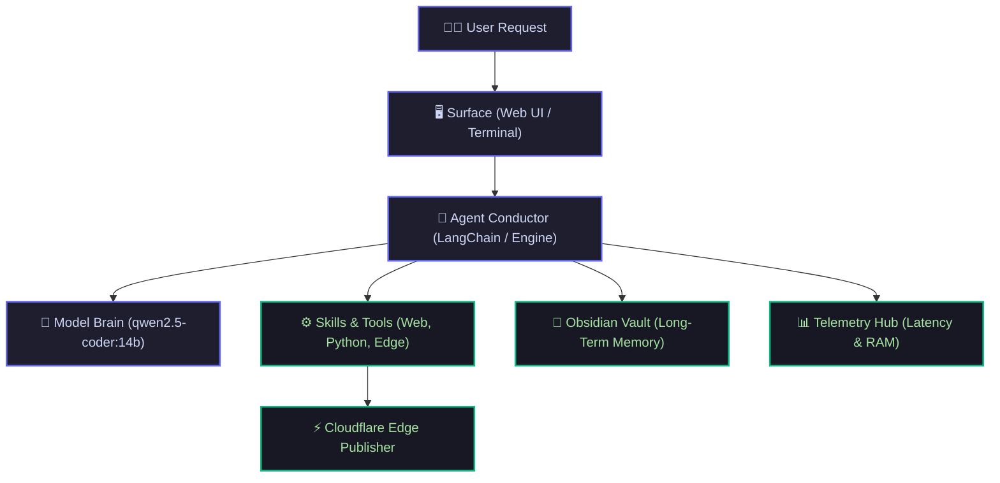
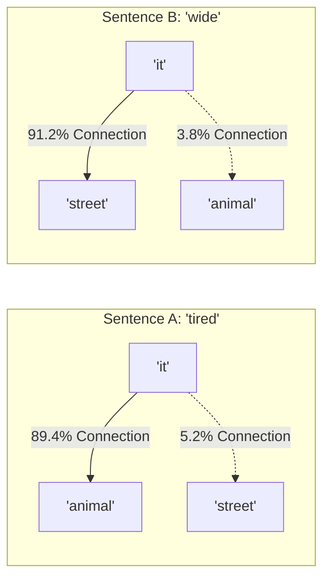

<div style="margin-bottom: 1.5rem;">
  <span class="status-badge live"><span class="dot"></span> Module 1 Lesson</span>
  <span class="status-badge">🧠 qwen2.5-coder:14b</span>
  <span class="status-badge">⚡ 24GB Unified Memory</span>
</div>

# <span class="gradient-text">Module 1: Inside the LLM Brain & Apple Silicon</span>

> **Ground Zero Concept:** Large Language Models are not magical thinking beings. Strip away the marketing hype, and an LLM has only one fundamental job: **Given a sequence of words, predict the single most probable next word based on 14 billion learned mathematical associations.**

---

## 🎭 The 8 Actors in a Local AI System

To understand how an AI assistant works, think of a movie production stage. The **Model** is only the lead actor—it needs 7 other systems to create a functional autonomous agent:



1. **The Model (`qwen2.5-coder:14b`)**: The mathematical brain predicting next words.
2. **The Runtime (`Ollama`)**: Loads 9.0GB weights into memory and fires GPU compute.
3. **The Agent Conductor (`Argus`)**: Decides when to answer vs when to call a tool.
4. **The Tools / Skills**: Hands and eyes (web scraper, vault reader, file writers).
5. **The Memory Vault**: Permanent Obsidian markdown filing cabinet.
6. **The Telemetry Engine**: Black-box flight recorder tracking latency & memory.
7. **The Edge Publisher**: Quartz + Cloudflare Workers for sub-second global publishing.
8. **The Surface**: The browser cockpit where you and Argus converse.

---

## 🧱 Stage 1: The Tokenizer (Words → Lego Bricks)

Computers cannot read English. Before the neural network processes a sentence, text is sliced into numeric barcodes called **Tokens**:

```text
"Argus is an autonomous AI agent"
       ↓
["Arg", "us", " is", " an", " autonomous", " AI", " agent"]
       ↓
[ 2803,  355,   374,   459,     39293,     15592,   8479  ]
```

<div class="mac-terminal">
  <div class="terminal-header">
    <span class="button close"></span>
    <span class="button minimize"></span>
    <span class="button maximize"></span>
    <span class="terminal-title">token-inspector — live output</span>
  </div>
  <div class="terminal-body">
    <div class="command-line">
      <span class="prompt">argus ❯</span>
      <span>python -m tiktoken "Argus on Apple Silicon"</span>
    </div>
    <div class="output success">[Token 1] "Arg"     → ID: 2803  (3 bytes)</div>
    <div class="output success">[Token 2] "us"      → ID: 355   (2 bytes)</div>
    <div class="output success">[Token 3] " on"     → ID: 389   (3 bytes)</div>
    <div class="output success">[Token 4] " Apple"  → ID: 8325  (6 bytes)</div>
    <div class="output success">[Token 5] " Silicon"→ ID: 38250 (8 bytes)</div>
    <div class="output highlight">Total: 5 tokens for 22 characters (~4.4 chars/token)</div>
  </div>
</div>

---

## 🗺️ Stage 2: Embeddings (GPS Coordinates for Meaning)

A token ID like `2803` has no intrinsic meaning. To capture relationships, each token is mapped to a **4,096-dimensional coordinate vector** called an **Embedding**.

In this conceptual space, words with similar meanings live together, allowing **Conceptual Vector Arithmetic**:

$$\text{Vector}(\text{"King"}) - \text{Vector}(\text{"Man"}) + \text{Vector}(\text{"Woman"}) \approx \text{Vector}(\text{"Queen"})$$

```text
                      ▲ Royalty (Z-Axis)
                      │
               [👑 King] ─── (Gender Vector) ──► [👸 Queen]
                      │                              │
                      │                              │
   ───────────────────┼──────────────────────────────┼──►
                      │                              │
               [👨 Man]  ─── (Gender Vector) ──► [👩 Woman]
                      │
```

---

## 🔦 Stage 3: Self-Attention (The Context Spotlight)

How does the neural network know what pronouns mean?

Consider these two sentences:
1. *"The animal didn't cross the street because **it** was too **tired**."*
2. *"The animal didn't cross the street because **it** was too **wide**."*

The **Self-Attention Spotlight** calculates a mathematical connection score between every word in the sentence:



When the trailing word is **"tired"**, the attention spotlight links **"it"** to **"animal"**. When the word is **"wide"**, the spotlight instantly shifts to **"street"**!

---

## ⚡ Stage 4: Apple Silicon Unified Memory & Quantization (`Q4_K_M`)

Why can a compact Mac mini run a 14-Billion parameter model faster than many expensive gaming PCs?

### 1. Unified Memory (UMA) Zero-Copy Architecture
In standard PCs, weights must be transferred over a slow PCIe bus between CPU RAM and GPU VRAM. On Apple Silicon, CPU and GPU share **one single high-bandwidth 24GB Unified Memory pool**:

```text
┌───────────────────────────────────────────────────────────┐
│                 Apple Silicon SoC Architecture             │
│  ┌──────────────┐     ┌──────────────┐     ┌───────────┐  │
│  │   CPU Core   │     │   GPU Core   │     │    NPU    │  │
│  └──────┬───────┘     └──────┬───────┘     └─────┬─────┘  │
│         │                    │                   │        │
│  ═══════╪════════════════════╪═══════════════════╪══════  │
│         └────────────┬───────┴───────────────────┘        │
│                      │ High-Speed Memory Bus (~120-150 GB/s)
│         ┌────────────┴────────────┐                       │
│         │ 24 GB Unified Memory    │                       │
│         │ (Shared Zero-Copy RAM)  │                       │
│         └─────────────────────────┘                       │
└───────────────────────────────────────────────────────────┘
```

### 2. The Quantization Math
- **Full Precision (FP16)**: $14\text{ Billion} \times 2\text{ bytes} = \mathbf{28\text{ GB}}$ *(Exceeds 24GB RAM)*
- **4-bit Quantization (`Q4_K_M`)**: $14\text{ Billion} \times 0.55\text{ bytes} = \mathbf{9.0\text{ GB}}$ *(Preserves 98.5% quality, fits easily in 24GB!)*

<div class="resource-gauge">
  <div class="gauge-header">
    <span>Mac mini 24GB Unified Memory Allocation</span>
    <span style="color: #6366f1;">15.5 GB Used / 8.5 GB Free Headroom</span>
  </div>
  <div class="gauge-track">
    <div class="gauge-segment system" style="width: 18%;" title="macOS System: 4.5 GB"></div>
    <div class="gauge-segment model" style="width: 38%;" title="Qwen 14B Weights: 9.0 GB"></div>
    <div class="gauge-segment kv-cache" style="width: 8%;" title="KV Context Cache: 2.0 GB"></div>
    <div class="gauge-segment free" style="width: 36%;" title="Free Headroom: 8.5 GB"></div>
  </div>
  <div class="gauge-legend">
    <div class="legend-item"><span class="legend-box" style="background: #10b981;"></span> macOS System (4.5 GB)</div>
    <div class="legend-item"><span class="legend-box" style="background: #6366f1;"></span> Model Weights 14B (9.0 GB)</div>
    <div class="legend-item"><span class="legend-box" style="background: #ec4899;"></span> KV Cache (2.0 GB)</div>
    <div class="legend-item"><span class="legend-box" style="background: #cbd5e1;"></span> Free Headroom (8.5 GB)</div>
  </div>
</div>

---

## 🎯 Key Takeaways from Module 1

1. **Tokens are Barcodes**: Models never see words—they see numeric token IDs (~4 characters per token).
2. **Embeddings Map Meanings**: Coordinate maps allow models to understand that *"Python"* is closer to *"def"* than to *"sandwich"*.
3. **Attention is the Context Spotlight**: Attention dynamically links related words across a prompt.
4. **Quantization is the Enabler**: 4-bit compression lets a 14B model run on a 24GB Mac mini with generous RAM to spare.

---

## 🚀 Next Up: Module 2

In [[curriculum|Module 2]], we will explore:  
**Tool Calling & The ReAct Execution Loop** — *How does a text-generating model actually execute Python functions, scrape the web, and synthesize answers?*
