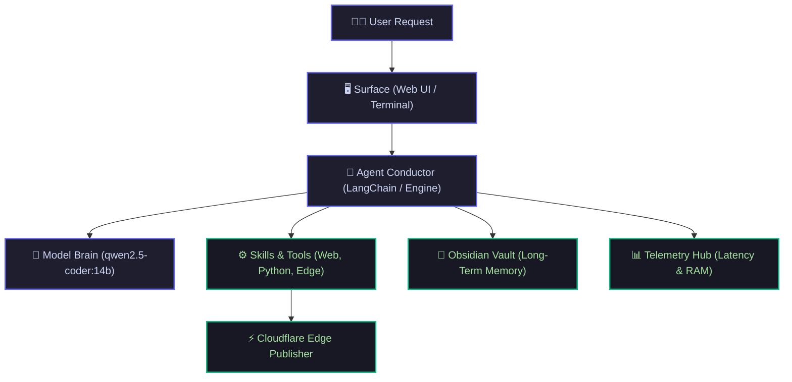
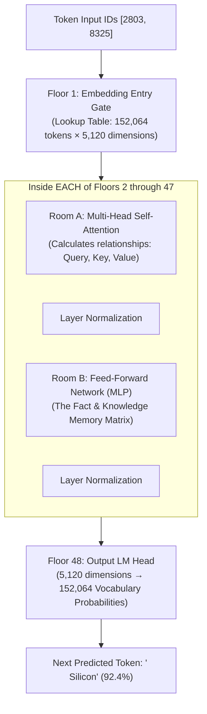

<div style="margin-bottom: 1.5rem;">
  <span class="status-badge live"><span class="dot"></span> Module 1 Master Guide</span>
  <span class="status-badge">🧠 qwen2.5-coder:14b</span>
  <span class="status-badge">⚡ 24GB Unified Memory</span>
</div>

# <span class="gradient-text">Module 1: Inside the LLM Brain, Synaptic Weights & Apple Silicon</span>

> **Ground Zero Concept:** Large Language Models are not magical thinking beings. Strip away the marketing hype, and an LLM has only one fundamental job: **Given a sequence of words, predict the single most probable next word based on 14 billion learned mathematical associations.**

---

## 🎭 The 8 Actors in a Local AI System

To understand how an AI assistant works, think of a movie production stage. The **Model** is only the lead actor—it needs 7 other systems to create a functional autonomous agent:



1. **The Model (`qwen2.5-coder:14b`)**: The mathematical brain predicting next words.
2. **The Runtime (`Ollama`)**: Loads 9.0GB weights into memory and fires GPU compute.
3. **The Agent Conductor (`Argus`)**: Decides when to answer vs when to call a tool.
4. **The Tools / Skills**: Hands and eyes (web scraper, vault reader, file writers).
5. **The Memory Vault**: Permanent Obsidian markdown filing cabinet.
6. **The Telemetry Engine**: Black-box flight recorder tracking latency & memory.
7. **The Edge Publisher**: Quartz + Cloudflare Workers for sub-second global publishing.
8. **The Surface**: The browser cockpit where you and Argus converse.

---

## 🔬 The Physical Anatomy: What *Is* a Model File on Disk?

When you download `qwen2.5-coder:14b` on your Mac mini, what is physically stored on your SSD?

If you open the binary `.gguf` file, it is literally **a structured file of numbers** divided into 3 sections:

```text
┌────────────────────────────────────────────────────────────────────────┐
│                   Inside a Model File (e.g. 9.0 GB GGUF)               │
├────────────────────────────────────────────────────────────────────────┤
│ 1. Metadata / Config (JSON)                                            │
│    • Architecture: "qwen2"                                             │
│    • Number of Layers: 48                                              │
│    • Hidden Dimension: 5,120                                           │
│    • Attention Heads: 40                                               │
├────────────────────────────────────────────────────────────────────────┤
│ 2. The Vocabulary Dictionary (~152,000 words & symbols)                │
│    • "apple" → 1842                                                    │
│    • "def"   → 840                                                     │
│    • "class" → 1205                                                    │
├────────────────────────────────────────────────────────────────────────┤
│ 3. The 14 Billion Weights (Raw Floating-Point Numbers)                │
│    • Layer 0: [ 0.0421, -1.2031,  0.8419,  0.0012, ... ]               │
│    • Layer 1: [-0.9124,  0.3120, -0.0041,  1.4120, ... ]               │
│    • ... (48 Layers Deep)                                              │
└────────────────────────────────────────────────────────────────────────┘
```

> [!NOTE]
> There is **no database**, **no internet connection**, and **no text document storage** inside the model file. It is 100% pure mathematical matrices.

---

## 🧠 Where is Knowledge Stored? (Synapses, Not Sentences)

> **The Big Question:** *When the model learned that "Paris is the capital of France" or "Python functions start with `def`", where did it save that text?*

**Answer: It did NOT save the text anywhere.**

Knowledge in a neural network is stored as **synaptic connection strengths (weights)** between artificial neurons, identical to how biological brain memory works:

```text
               Biological Brain                   Artificial Neural Network
        ┌─────────────────────────────┐        ┌─────────────────────────────┐
        │ Neurons + Synaptic Strength │        │ Numbers inside Weight Matrix│
        │ (Chemical connections)      │        │ (Mathematical values)       │
        └─────────────────────────────┘        └─────────────────────────────┘
```

When you learn that *"Fire is hot"*, your brain doesn't save a text file. Your biological neurons adjust their synaptic strength so that the sensory input of fire flows straight to danger/pain.

In an LLM, during training across 3 trillion tokens, whenever it made a mistake, a mathematical error signal (*gradient descent*) nudged millions of numbers by $0.0001$. Over time, these numbers create a **geometric gravity field**. When the vectors for `"capital"`, `"of"`, and `"France"` enter the network, the math naturally funnels toward `"Paris"`.

---

## 🏢 The 48-Story Transformer Skyscraper

Inside `qwen2.5-coder:14b`, the computation flows upward through a **48-floor skyscraper**:



### The Two Machinery Rooms on Each Floor:
1. **Room A: Self-Attention (`Query, Key, Value` Matrices)**  
   - The *Context & Grammar Analyzer*. It calculates who is talking to whom (*"Who does 'it' refer to in this sentence?"*).
2. **Room B: Feed-Forward Network (FFN / MLP)**  
   - The *Fact & World Memory Bank*. This matrix acts like an associative memory table, connecting concepts and code patterns.

---

## 🏎️ How Do Different Models Differ?

If all models are next-word predictors, why do different models exist?

| Dimension | Small Models (`3B`) | Medium Models (`14B` - Argus) | Giant Models (`70B+`) |
| :--- | :--- | :--- | :--- |
| **RAM Footprint** | 2 – 4 GB | **8 – 10 GB (Fits in Mac mini!)** | 40 – 250+ GB |
| **Coding & Tooling** | Basic scripts | **Flawless AST & JSON Schemas** | Complex multi-file systems |
| **Architecture** | Dense | **Dense (Fast on Apple Silicon)** | Mixture of Experts (MoE) |
| **Context Window** | 8K – 32K | **128,000 Tokens (Whole repos)** | 128K – 2M Tokens |

---

## 🎲 What Is Temperature? (The Roulette Wheel)

Before picking the next word, the model calculates probability slices across all 152,000 candidate words. **Temperature is the knob that changes the shape of those slices**:

```text
  [ Temperature = 0.0 (Cold / Code) ]        [ Temperature = 1.5 (Boiling Chaos) ]

       ┌────────────────────────┐                  ┌───────────┬───────────┐
       │                        │                  │   blue    │  cloudy   │
       │         "blue"         │                  │   (28%)   │   (24%)   │
       │        (100%)          │                  ├───────────┼───────────┤
       │                        │                  │   dark    │   pizza   │
       └────────────────────────┘                  │   (25%)   │   (23%)   │
         Only #1 Token Allowed                     └───────────┴───────────┘
         Zero Risk / Strict Code                     All Words Flatten Out
```

* **Temperature $0.0 - 0.2$ (Cold / Coding)**: The wheel is frozen. Always selects the #1 mathematically optimal word. *(Argus default: `0.1`)*.
* **Temperature $0.7 - 0.8$ (Human / Chat)**: Balanced natural conversation.
* **Temperature $1.2+$ (High Randomness)**: Slices flatten out, producing hallucinations and creative poetry.

---

## ⚡ Apple Silicon Unified Memory Architecture & Quantization

Why does `qwen2.5-coder:14b` run so fast on a Mac mini?

```text
┌───────────────────────────────────────────────────────────┐
│                 Apple Silicon SoC Architecture             │
│  ┌──────────────┐     ┌──────────────┐     ┌───────────┐  │
│  │   CPU Core   │     │   GPU Core   │     │    NPU    │  │
│  └──────┬───────┘     └──────┬───────┘     └─────┬─────┘  │
│         │                    │                   │        │
│  ═══════╪════════════════════╪═══════════════════╪══════  │
│         └────────────┬───────┴───────────────────┘        │
│                      │ High-Speed Memory Bus (~120-150 GB/s)
│         ┌────────────┴────────────┐                       │
│         │ 24 GB Unified Memory    │                       │
│         │ (Shared Zero-Copy RAM)  │                       │
│         └─────────────────────────┘                       │
└───────────────────────────────────────────────────────────┘
```

### The Quantization Math
- **FP16 Uncompressed**: $14\text{B} \times 2\text{ bytes} = \mathbf{28\text{ GB}}$ *(Exceeds Mac mini 24GB RAM)*
- **`Q4_K_M` 4-bit Quantization**: $14\text{B} \times 0.55\text{ bytes} = \mathbf{9.0\text{ GB}}$ *(Fits in RAM with ~8.5GB free headroom!)*

---

## 🎯 Key Takeaways from Module 1

1. **A Model is a Matrix File**: A `.gguf` file is metadata + vocabulary + billions of floating-point numbers.
2. **Knowledge is Synaptic Tension**: Facts are not stored as sentences; they are stored in the geometric attraction between matrix weights.
3. **The 48-Story Tower**: Signals enter Floor 1 (Embeddings), pass through Attention & FFN rooms on Floors 2–47, and exit Floor 48 (LM Head).
4. **The Agent Gives Life to the Amnesiac**: Because the model's memory wipes between prompts, the Agent harness injects memory, tool results, and system state into every request.

---

## 🚀 Next Up: Module 2

In [[curriculum|Module 2]], we will explore:  
**Tool Calling & The ReAct Execution Loop** — *How does a text model actually decide to execute Python functions, search the live web, and update Obsidian notes?*
